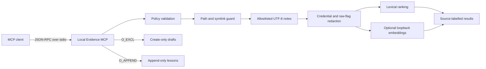

# Local Evidence MCP

A local-first Model Context Protocol (MCP) server for retrieving a deliberately
small evidence set and recording reviewed conclusions without giving an agent
general filesystem access.

This repository demonstrates a practical RAG and agent-harness pattern:

- policy-gated reads instead of whole-vault access;
- redaction before content reaches the client or search index;
- optional local Ollama embeddings with deterministic lexical fallback;
- content-digest embedding caches that do not store source text;
- create-only notes and an append-only lesson ledger;
- newline-delimited JSON-RPC over stdio with no runtime dependencies; and
- explicit rejection of likely credentials and raw challenge flags.

The included vault and policy are synthetic examples. No personal vault data,
private policy, embedding cache, agent configuration, or credentials are part
of this repository.

## Architecture



The server advertises no shell, SSH, browser, messaging, remote retrieval, or
arbitrary filesystem capability. The only optional HTTP call is to an
unauthenticated loopback embedding endpoint.

## Quick start

Requirements: Python 3.11 or newer. Ollama is optional.

```powershell
git clone https://github.com/Labeeb2339/local-evidence-mcp.git
cd local-evidence-mcp
./run_server.cmd --check
```

On macOS or Linux:

```sh
chmod +x run_server.sh
./run_server.sh --check
```

The default health check uses `examples/vault` and
`examples/policy.example.json`. If Ollama is not available, the check reports
that lexical fallback is active; retrieval still works.

Try a JSON-RPC request directly:

```powershell
'{"jsonrpc":"2.0","id":1,"method":"tools/list"}' | ./run_server.cmd
```

## Configure your own evidence root

Copy the example policy to a local, ignored file and edit only the relative
paths that should be visible:

```powershell
Copy-Item examples/policy.example.json policy.json
$env:LOCAL_EVIDENCE_ROOT = "D:\path\to\your\notes"
$env:LOCAL_EVIDENCE_POLICY = "$PWD\policy.json"
./run_server.cmd --check
```

The policy separates four decisions:

| Section | Purpose |
| --- | --- |
| `read.files` | Exact files the server may read |
| `read.globs` | Non-recursive relative globs, such as `notes/*.md` |
| `excluded` | Paths denied even if another rule matches |
| `write` | One create-only directory and one append-only file |

Limits cap file size, result count, write size, index size, and chunk length.
Absolute paths, traversal components, NTFS stream syntax, recursive read globs,
and linked files are rejected.

To force offline lexical mode, set `embeddings.enabled` to `false`. When
embeddings are enabled, the endpoint must use plain HTTP on `127.0.0.1`,
`localhost`, or `::1`; remote and credential-bearing URLs are refused.

## MCP client configuration

After installing the package with `python -m pip install -e .`, a client can
launch it with the console script:

```json
{
  "mcpServers": {
    "local-evidence": {
      "command": "local-evidence-mcp",
      "args": [
        "--root",
        "<absolute-path-to-evidence-root>",
        "--policy",
        "<absolute-path-to-local-policy.json>"
      ]
    }
  }
}
```

Keep the real policy and evidence root outside version control. The example
policy is safe to publish because it references only the included synthetic
fixtures.

## Tools

| Tool | Boundary |
| --- | --- |
| `evidence_status` | Reports configured capabilities and exclusions |
| `evidence_search` | Searches sanitized allowlisted chunks |
| `evidence_read` | Reads one sanitized allowlisted file |
| `evidence_create_note` | Creates a new draft with exclusive-create semantics |
| `evidence_append_lesson` | Appends one evidence-backed entry to a fixed ledger |

Tool input is checked again at runtime instead of relying only on the JSON
schemas presented to the MCP client.

## Security properties

| Risk | Control |
| --- | --- |
| Broad filesystem exposure | Relative allowlist plus resolved-root containment |
| Traversal or linked-file escape | Component validation and symlink rejection |
| Secret leakage in reads | Redaction before direct output and chunking |
| Sensitive query or durable write | Credential and raw-flag rejection |
| Destructive overwrite | `O_CREAT | O_EXCL` for draft creation |
| Rewrite of the lesson ledger | Fixed destination opened with `O_APPEND` |
| Embedding data leakage | Loopback-only endpoint and vector-only cache |
| Prompt injection in notes | Evidence warnings and no execution tools |

Regex redaction is defense in depth, not a substitute for keeping secrets out
of the evidence root. Local operating-system permissions still define who can
start the process and edit its policy.

## Test

The full suite uses only the standard library:

```powershell
$env:PYTHONPATH = "src"
python -m unittest discover -s tests -v
```

CI runs the suite on Python 3.11, 3.12, and 3.13 and performs a Gitleaks scan.
Tests cover path containment, exclusions, redaction, lexical fallback, semantic
ranking, plaintext-free caching, create-only and append-only writes, sensitive
input rejection, symlink handling, and MCP protocol responses.

## Design scope

This is a compact reference implementation, not a hosted vector database or an
enterprise authorization service. It is most useful when an assistant needs a
small, inspectable local knowledge boundary and the operator values safe
degradation when the embedding service is offline.

## License

[MIT](LICENSE)
